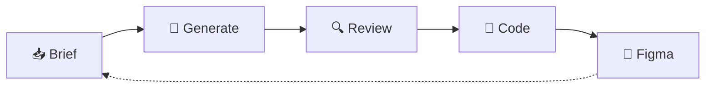

# 9 · Workflow — Claude Design → Claude Code

<aside>
**Operating loop** for your design system. **Claude Design** is the conversational front-end between a brief and shipped code. This page does **not** replace the hub or the Figma library; it is **bound** by the tokens, states, and governance in [UI/UX guidelines hub](UI%20UX%20guidelines%2020be6c5f913d4f53ac0e76eb5e904eef.md) and [`BRANDBOOK.md`](../../BRANDBOOK.md).

</aside>

## TL;DR

- **Briefs** (ch. 1) → **Claude Design** generates against your onboarded system (ch. 3 + BRANDBOOK.md) → reviewers refine against state matrices (ch. 5) and visual proof (ch. 4) → **handoff to Claude Code** for implementation (ch. 6) → frames **mirrored back** into the Figma library.
- Treat AI tools as **assistive**; the hub + BRANDBOOK.md remain **binding**.

## Why this exists

Claude Design generates UI from natural language and can infer a design system from your codebase. Without guardrails, AI tools drift into generic defaults. This page binds Claude Design to **your brand tokens** from BRANDBOOK.md so output is shippable from day one.

## Inputs — single source of truth

| Source | What it provides | Reference |
| --- | --- | --- |
| **Spec hub** | Entry, principles, semantic color (non-negotiable), buttons-at-a-glance | [UI/UX guidelines hub](UI%20UX%20guidelines%2020be6c5f913d4f53ac0e76eb5e904eef.md) |
| **Ch. 1 — Scope & principles** | UI element inventory, new project checklist | [1 · Scope & principles](../Standards/1%20%C2%B7%20Scope%20&%20principles%203454544eeb42810c89b3d3e4ef563c43.md) |
| **Ch. 3 — Brand, layout & tokens** | Semantic palette, gradient (135° **[YOUR_PRIMARY_DARK] → [YOUR_PRIMARY]**), typography, 8pt grid, radius, shadows, *Visual swatches* | [3 · Brand, layout & tokens](../Standards/3%20%C2%B7%20Brand,%20layout%20&%20tokens%203454544eeb4281ce92bbf7eb90df3835.md) |
| **Ch. 4 — Style Card for UI/UX** | *Embedded pattern gallery* — visual proof for hero, chrome, cards, CTAs, accent discipline | [4 · Style Card for UI/UX](../Standards/4%20%C2%B7%20Style%20Card%20for%20UI%20UX%203454544eeb428013a31df04ad5caa2e2.md) |
| **Ch. 5 — Components & patterns** | Authoritative button state matrix, accessibility, content rules | [5 · Components & patterns](../Standards/5%20%C2%B7%20Components%20&%20patterns%203454544eeb4281479040ce5bd99406c7.md) |
| **Ch. 6 — Governance & shipping** | PR checklist, exceptions log, sign-off | [6 · Governance & shipping](../Process%20&%20Governance/6%20%C2%B7%20Governance%20&%20shipping%203454544eeb4281808c68e067d0b6a0f7.md) |
| **Code** | `globals.css`  • ShadCN/Tailwind primitives (token names must match in design) | repo |
| **Figma library** | Canonical mirror of tokens + components | (link in ch. 3 once published) |

## Visual: the loop at a glance

1. 📥 **Brief** — write the ask
2. 🎨 **Generate** — Claude Design creates frames
3. 🔍 **Review** — check tokens, states, a11y
4. 🚀 **Code** — hand off to Claude Code
5. 🔁 **Figma** — mirror back to the library

## The loop — step by step

### 0 · Onboard Claude Design (one-time per project)

**Goal:** make Claude Design use your brand tokens from BRANDBOOK.md, not generic UI-kit defaults.

- Point Claude Design at the **repo** so it learns ShadCN + Tailwind variants and reads `globals.css` token names.
- Upload (or link) the hub + chapters **3 · Brand, layout & tokens** and **5 · Components & patterns** so the inferred system mat